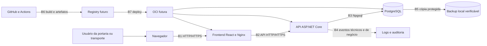

# Modelagem de ameaças

## Identificação

**Sistema:** Controle de Acesso de Veículos do IFPE — Campus Belo Jardim

**Método:** diagrama de fluxo de dados e classificação STRIDE

**Versão:** 1.7

**Data de referência:** 29 de agosto de 2026

**Rastreabilidade:** Issues #26 e #67

## Objetivo e limites

Esta modelagem identifica riscos de segurança e privacidade no desenho atual e
planejado do sistema. Ela cobre frontend, API, PostgreSQL, containers, GitHub,
CI/CD, operação local, implantação futura e backups.

Não são considerados implementados:

- matriz definitiva de autorização e ciclo completo de contas;
- auditoria transversal e imutável;
- demais endpoints funcionais além dos fluxos geral, correção descritiva, institucional, consultas históricas e catálogos de frota e motoristas;
- ambiente de homologação ou produção;
- OCI, domínio, HTTPS e proxy reverso;
- backup protegido de produção, política de recuperação e contingência;
- observabilidade e resposta a incidentes.

O documento deve ser atualizado quando esses componentes forem projetados ou
implementados.

## Metodologia

STRIDE organiza ameaças em falsificação de identidade, adulteração, repúdio,
divulgação de informação, negação de serviço e elevação de privilégio. O processo
adotado é: desenhar o fluxo, identificar fronteiras de confiança, enumerar riscos,
definir mitigações e validar sua implementação.

Essa abordagem segue o processo do
[Microsoft Threat Modeling Tool](https://learn.microsoft.com/en-us/azure/security/develop/threat-modeling-tool-getting-started).
Os controles são complementados pelo
[OWASP ASVS](https://owasp.org/www-project-application-security-verification-standard/)
e pelo
[NIST SSDF SP 800-218](https://csrc.nist.gov/pubs/sp/800/218/final).

## Escala de risco

| Valor | Probabilidade | Impacto |
|---:|---|---|
| 1 | Improvável no desenho atual | Efeito localizado e recuperável |
| 2 | Possível ou dependente de condição | Interrupção ou exposição limitada |
| 3 | Provável sem controle | Exposição pessoal, perda de integridade ou indisponibilidade relevante |

O nível é `probabilidade × impacto`:

- 1–2: baixo;
- 3–4: médio;
- 6–9: alto.

A classificação orienta prioridade, mas não substitui decisão institucional.

## Ativos

| Ativo | Necessidade de proteção |
|---|---|
| Dados de pessoas e documentos opcionais | Confidencialidade, finalidade e minimização |
| Placas, vínculos e histórico de acesso | Confidencialidade e integridade |
| Itinerários e quilometragens | Integridade e acesso restrito |
| Credenciais, sessões e hashes | Confidencialidade e resistência a fraude |
| Perfis e permissões | Integridade e menor privilégio |
| Auditoria | Integridade, disponibilidade e não repúdio |
| Banco e migrations | Integridade, disponibilidade e recuperação |
| Código, workflows e dependências | Integridade da cadeia de suprimentos |
| Configurações e segredos | Confidencialidade e rotação |
| Continuidade da portaria | Disponibilidade e reconciliação confiável |

## Atores

- porteiro e vigilante;
- Setor de Transporte;
- administrador autorizado;
- equipe de desenvolvimento e operação;
- GitHub Actions e serviços de dependências;
- pessoa externa sem autenticação;
- usuário autenticado mal-intencionado;
- atacante com acesso à rede, dispositivo ou credencial;
- fornecedor ou dependência comprometida.

## Fluxo de dados

## Fronteiras de confiança

| Fronteira | Mudança de confiança | Estado |
|---|---|---|
| B1 | Dispositivo/rede do usuário para frontend | Local implementado; produção pendente |
| B2 | Código executado no navegador para API | JWT, contratos operacionais, consultas históricas e catálogos de frota e motoristas implementados; matriz final e frontend pendentes |
| B3 | API para PostgreSQL | Implementado localmente |
| B4 | Aplicação para logs e auditoria | Logging HTTP estruturado e correlacionado; auditoria transacional implementada nos fluxos geral, correção descritiva, institucional e catálogos |
| B5 | Banco para backup | Dump e restauração isolada implementados apenas no desenvolvimento local; proteção externa pendente |
| B6 | Repositório para runner e artefatos | CI inicial implementada |
| B7 | Registry para infraestrutura OCI | Não implementado |

Todo dado vindo do navegador atravessa uma fronteira não confiável. Validação no
frontend melhora usabilidade, mas não é controle de segurança suficiente.

## Ameaças e mitigações

| ID | STRIDE | Cenário | P | I | Nível | Mitigação e rastreabilidade | Estado |
|---|---|---|---:|---:|---:|---|---|
| TM-01 | Spoofing | Conta compartilhada ou credencial roubada impede identificar o operador | 3 | 3 | 9 | Contas individuais, hash de senha, login uniforme, bloqueio e testes — #29 | Parcialmente mitigado; recuperação e ciclo de conta pendentes |
| TM-02 | Spoofing | Usuário acessa frontend ou API falsos em rede não confiável | 2 | 3 | 6 | Domínio controlado, HTTPS, certificados e orientação operacional — #25 e implantação futura | Planejado |
| TM-03 | Tampering | Cliente altera IDs, status, horários, quilometragem ou identificação de frota enviados à API | 3 | 3 | 9 | Políticas por recurso, DTOs, validação, normalização, horário do servidor e unicidade transacional — #29, #31, #47, #53, #55, #61 e #65 | Correção geral limitada a campos descritivos; identidade, tempo e estado permanecem imutáveis; correções institucionais pendentes |
| TM-04 | Tampering | Acesso direto ao banco altera ou remove histórico | 2 | 3 | 6 | Rede restrita, menor privilégio, auditoria, backup e separação de usuários — #30 e #67 | Ensaio local de recuperação implementado; controles de produção pendentes |
| TM-05 | Tampering | Workflow, dependency ou imagem comprometida altera o artefato entregue | 2 | 3 | 6 | Branch protegida, Dependabot, lockfiles, scanner, build e proveniência — #25 | Parcial |
| TM-06 | Repudiation | Operador nega inclusão, correção ou encerramento de registro | 3 | 3 | 9 | Usuário autenticado, ator persistido, justificativa, correlation ID e auditoria imutável suficiente — #29, #31, #47, #51, #53, #55, #57, #61 e #65 | Correção descritiva geral auditada; correções institucionais e imutabilidade por privilégios pendentes |
| TM-07 | Information disclosure | Stack trace, log ou erro expõe documento, token ou configuração | 2 | 3 | 6 | Erros seguros, logs mínimos e testes de não exposição — #31 e #49 | Parcialmente mitigado; auditoria e logs externos pendentes |
| TM-08 | Information disclosure | Consulta ou exportação expõe histórico além da necessidade | 2 | 3 | 6 | Menor privilégio, filtros por finalidade e auditoria de consulta/exportação — #29, #31, #59 e #63 | Histórico geral restrito a Portaria, Vigilância e Administração; histórico institucional restrito a Transporte e Administração; auditoria de consulta e exportação permanecem pendentes |
| TM-09 | Information disclosure | Segredo entra no Git, imagem, artefato ou Wiki | 2 | 3 | 6 | `.gitignore`, exemplos fictícios, secret scanning e rotação — #25 | Parcial |
| TM-10 | Information disclosure | PostgreSQL publicado em interface de rede inadequada | 2 | 3 | 6 | Não publicar banco em produção, firewall e rede privada — #25 e implantação futura | Pendente |
| TM-11 | Denial of service | Payload ou consulta cara esgota API ou banco | 2 | 2 | 4 | Limite de payload, paginação, timeout, rate limiting e índices medidos — #31, #49, #59 e #63 | Limite global de 1 MiB e consultas históricas paginadas, com período limitado e índices específicos; rate limiting permanece pendente |
| TM-12 | Denial of service | Falha de rede, API ou PostgreSQL interrompe a portaria | 3 | 3 | 9 | Readiness, monitoramento, backup e contingência reconciliável — #25 e #30 | Pendente |
| TM-13 | Elevation of privilege | Usuário comum executa operação administrativa, corrige registro ou acessa histórico indevido | 3 | 3 | 9 | Políticas explícitas, deny-by-default, correção, consultas históricas e leitura/gestão de catálogos separadas e testes por perfil — #29, #55, #57, #59, #63 e #65 | Parcialmente mitigado; matriz final pendente |
| TM-14 | Elevation of privilege | Container executado como root amplia impacto de exploração | 2 | 3 | 6 | Usuário não privilegiado, filesystem e capabilities restritos — #25 | Planejado |
| TM-15 | Information disclosure | Backup desprotegido expõe dados e histórico | 2 | 3 | 6 | Diretório fora do Git no desenvolvimento; criptografia, acesso restrito, retenção e inventário em produção — #30 e #67 | Parcialmente mitigado no desenvolvimento; produção pendente |
| TM-16 | Information disclosure | Retenção indefinida mantém dados pessoais sem finalidade | 2 | 3 | 6 | Política de retenção, descarte e validação institucional — #30 | Pendente institucional |
| TM-17 | Tampering | Migration causa perda ou transformação sem semântica confiável | 2 | 3 | 6 | Revisão, backup com restauração verificada, upgrade/downgrade e falha explícita — #23, #30 e #67 | Backup/restauração local e testes de migration implementados; processo de produção pendente |
| TM-18 | Repudiation | Falha na auditoria permite operação sem trilha | 2 | 3 | 6 | Atomicidade, falha fechada, alerta e monitoramento — #31, #51, #53, #55, #57 e #65 | Mitigado nos fluxos geral, correção descritiva, institucional e catálogos; alerta e demais operações pendentes |

## Controles existentes verificados

- separação entre Domain, Application, Infrastructure e API;
- EF Core restrito à Infrastructure/API;
- migrations versionadas e sem execução automática no startup;
- autenticação JWT com validade curta, chave externa e validação de emissor e audiência;
- hash de senha com salt e derivação, bloqueio temporário e resposta uniforme de login;
- autorização deny-by-default e políticas preliminares testadas;
- políticas distintas para consultar e gerenciar a frota institucional;
- políticas distintas para o histórico geral e o histórico institucional;
- política de correção separada da operação e da consulta, limitada a Vigilante e Administrador;
- contratos operacionais e catálogo inicial protegidos, com validação no servidor e erros previsíveis;
- data/hora de entrada e saída definidas pelo servidor e vinculadas ao usuário autenticado;
- transação e índice único parcial impedem dois acessos abertos para o mesmo veículo;
- transação e índice único parcial impedem dois usos institucionais abertos para o mesmo veículo;
- correlation ID validado ou gerado pelo servidor em todas as respostas;
- logs HTTP estruturados com template de rota, sem valores da URL, query string, corpo ou cabeçalho de autorização;
- exceções inesperadas retornam `ProblemDetails` sem mensagem interna ou stack trace;
- limite global de 1 MiB para corpos de requisição;
- consultas históricas com período máximo de 366 dias, paginação limitada e índices orientados aos filtros temporais;
- auditoria dos fluxos geral, institucional e cadastro da frota atômica, associada ao operador e sem duplicação de dados pessoais, placa, identificação patrimonial ou itinerário;
- correção descritiva exige justificativa e audita apenas os nomes dos campos alterados, sem copiar objetivo ou observação;
- placa e identificação institucional normalizadas, com unicidade garantida no PostgreSQL;
- migration de alinhamento falha em vez de inventar dados legados;
- documento pessoal opcional e dados de teste fictícios;
- `.env` ignorado e exemplos sem segredo real;
- backup lógico local em formato custom, fora do Git, validado por restauração completa em banco temporário isolado;
- branch protegida, Pull Requests e CI;
- testes unitários e integração PostgreSQL no PR #28;
- auditoria de vulnerabilidades NuGet executada na #23 e #24.

## Risco residual atual

O risco residual permanece alto para ciclo de identidade, autorização definitiva,
auditoria dos demais fluxos, imutabilidade e continuidade de produção porque esses controles ainda estão incompletos. O ensaio local de restauração reduz o risco de um dump inválido, mas não substitui armazenamento externo protegido, política institucional nem contingência. Portanto, a
API atual não deve ser tratada como pronta para exposição pública ou produção.

## Responsabilidades

| Área | Responsabilidade |
|---|---|
| Backend/DB | validação, autenticação, autorização, persistência e auditoria |
| Infra/DevOps | secrets, rede, containers, CI/CD, backup e observabilidade |
| Frontend | não armazenar segredos; reduzir exposição; tratar sessão com segurança |
| QA | testes negativos, autorização, migrations, recuperação e regressão |
| Responsáveis institucionais | finalidade, perfis, retenção e contingência |
| Equipe | revisão do modelo a cada mudança arquitetural relevante |

## Gatilhos de revisão

Revisar esta modelagem quando ocorrer:

- novo ator, perfil ou endpoint;
- definição da autenticação;
- mudança no modelo de dados pessoais;
- exportação ou relatório;
- integração externa;
- implantação em homologação/produção;
- mudança de rede, container, CI/CD ou backup;
- incidente ou vulnerabilidade relevante.

## Pendências de validação

- matriz final de permissões;
- necessidade e finalidade de documento pessoal;
- retenção e descarte;
- infraestrutura real da portaria;
- RTO, RPO e procedimento de contingência;
- responsáveis por operação e incidentes;
- topologia de implantação na OCI.
